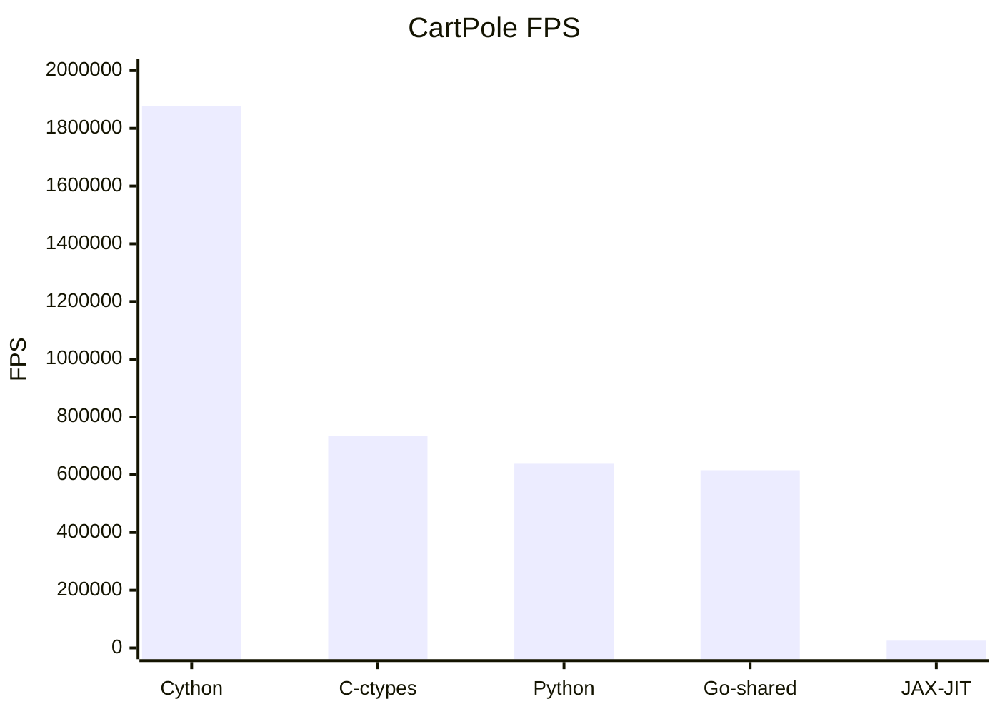
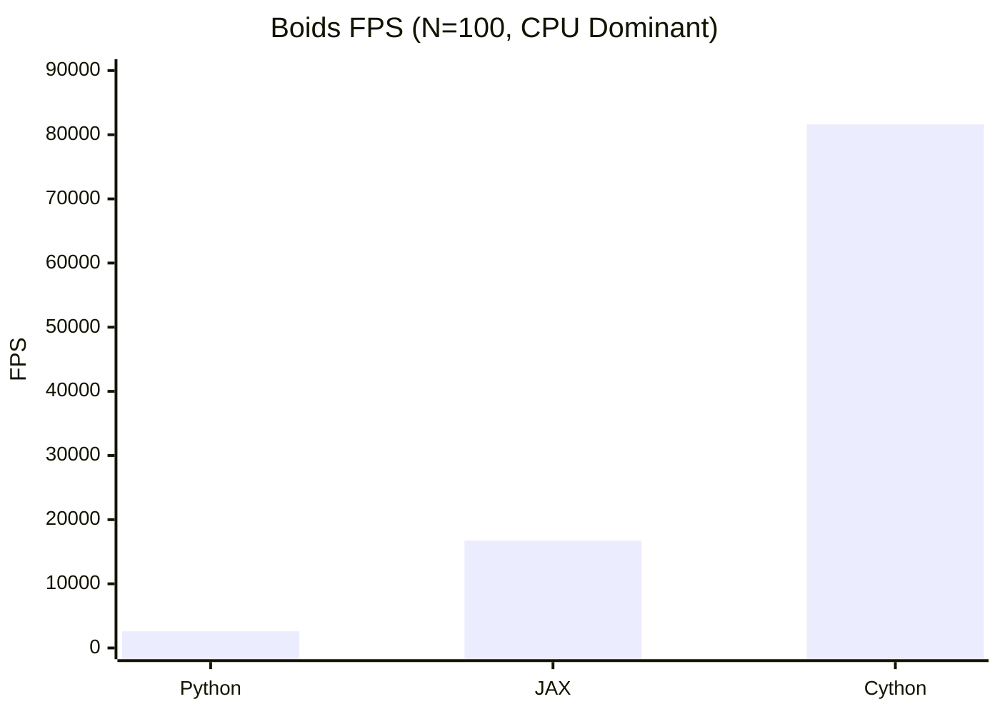
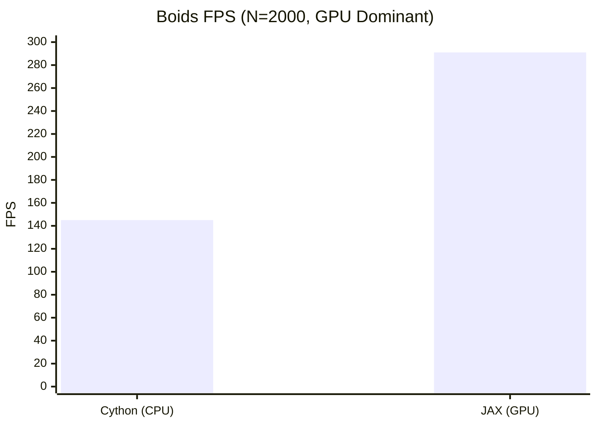

# 强化学习环境性能基准测试报告 (Multi-Env Benchmark)

> **摘要**: 本报告旨在评估不同编程语言及编译优化技术在不同复杂度（简单逻辑 vs 复杂交互）RL 环境下的性能差异。测试涵盖了从小规模标量计算到大规模矩阵运算的典型场景。

## 1. 环境定义

### 1.1 Hello World: CartPole
- **特征**: 极简物理逻辑，仅涉及少量标量运算。
- **复杂度**: $O(1)$
- **目的**: 测试跨语言调用开销 (Overhead) 及基础调度延迟。

### 1.2 Complex: Boids (鸟群模拟)
- **特征**: 模拟 $N$ 个个体的群体行为（分离、对齐、凝聚），涉及密集的距离矩阵计算。
- **复杂度**: $O(N^2)$
- **目的**: 测试循环优化能力 (Cython) 及 向量化并行计算能力 (JAX/NumPy)。

## 2. 测试结果 (Results)

### 2.1 CartPole 性能 (FPS)
*(数值越大越好)*

**结论**: 
- **Cython** 是轻量级任务的王者，提供了近 3 倍的加速。
- **JAX** 在简单串行任务中严重“杀鸡用牛刀”，因调度开销导致性能垫底 (0.04x)。
- **C/Go** 受限于跨语言调用 (Overhead)，在计算量极小的任务中优势不明显。

---

### 2.2 Boids 性能对比 (N=100 vs N=2000)

我们测试了两种规模，分别代表 **CPU 密集型循环** 和 **GPU 密集型矩阵运算**。

#### 小规模 (N=100) - CPU 战场
*(Cython 利用编译优化碾压全场)*

| Backend            | FPS (N=100) | Speedup   |
| :----------------- | :---------- | :-------- |
| **Python (NumPy)** | 2,593       | 1.0x      |
| **Cython**         | **81,613**  | **31.5x** |
| **JAX (Metal)**    | 16,729      | 6.5x      |

#### 大规模 (N=2000) - GPU 战场
*(计算量增加 400 倍，JAX 利用 M4 GPU 完成逆袭)*

| Backend             | FPS (N=2000) | Speedup vs Cython |
| :------------------ | :----------- | :---------------- |
| **Cython (CPU)**    | 145          | 1.0x              |
| **JAX (Metal GPU)** | **291**      | **2.0x**          |

**深入分析**:
- **Cython 的极限**: 在 $N=100$ 时，Cython 将 Python 的 $O(N^2)$ 循环编译为 C 代码，消除了解释器开销，获得了惊人的 **31倍** 加速。但在 $N=2000$ 时，它受限于 CPU 单核算力，FPS 急剧下降。
- **JAX 的逆袭**: 在 $N=2000$ 时，计算瓶颈从“逻辑跳转”转移到了“大规模矩阵乘法”。此时 Apple M4 的 GPU 并行能力开始发力，JAX 成功反超 Cython **2倍**。随着 $N$ 继续增大，这一差距将指数级拉大。

## 3. 综合总结与选型指南

| 场景特征                                                      | 推荐技术栈     | 核心理由                                                                                   |
| :------------------------------------------------------------ | :------------- | :----------------------------------------------------------------------------------------- |
| **轻量级 / 标量逻辑** *(e.g. Classic Control, CartPole)*   | **Cython**     | **零开销**。在极小计算量下，避免了 Python 解释器开销，同时没有 JAX/TensorFlow 的调度延迟。 |
| **中等规模 / 复杂循环** *(e.g. Multi-Agent < 500 agents)*  | **Cython**     | **单核性能极致**。能够将复杂的逻辑判断和循环完全编译为 C，跑满 CPU 单核频率。              |
| **大规模 / 矩阵密集** *(e.g. Swarm > 1000 agents, Vision)* | **JAX**        | **算力吞吐**。当计算量大到能摊薄数据传输和调度开销时，GPU 的并行能力无人能敌。             |
| **复用现有物理库** *(e.g. MuJoCo, Bullet)*                 | **C (ctypes)** | **生态复用**。仅适合作为胶水层调用现有的高性能 C++ 物理引擎，不建议手写 C 逻辑。           |
