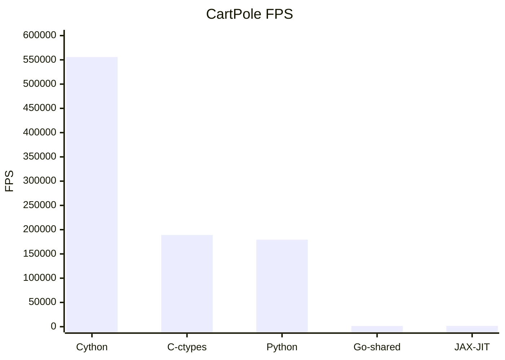
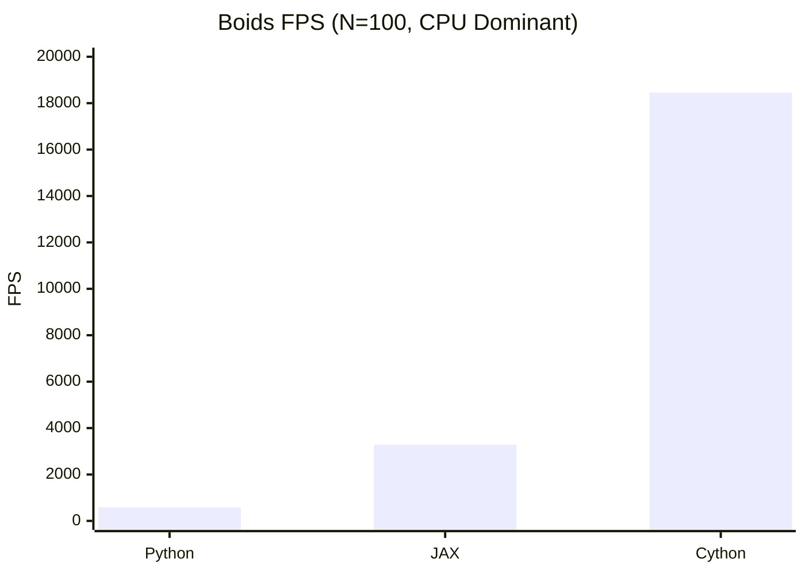

# 强化学习环境性能基准测试报告 (Multi-Env Benchmark)

> **摘要**: 本报告旨在评估不同编程语言及编译优化技术在不同复杂度（简单逻辑 vs 复杂交互）RL 环境下的性能差异。测试涵盖了从小规模标量计算到大规模矩阵运算的典型场景。

## 1. 环境定义

> 仅测试使用不同语言或架构实现相同的环境的性能差异, 不测试不同算法的性能差异.

### 1.1 Hello World: CartPole
- **特征**: 极简物理逻辑，仅涉及少量标量运算。
- **复杂度**: $O(1)$
- **目的**: 测试跨语言调用开销 (Overhead) 及基础调度延迟。

### 1.2 Complex: Boids (鸟群模拟)
- **特征**: 模拟 $N$ 个个体的群体行为（分离、对齐、凝聚），涉及密集的距离矩阵计算。
- **复杂度**: $O(N^2)$
- **目的**: 测试循环优化能力 (Cython) 及 向量化并行计算能力 (JAX/NumPy)。

## 2. 测试结果 (Results)

### 2.1 CartPole 性能 (FPS)

> 10000 episodes

| 实现方式 (Backend)    | 总耗时 (Total Time) [s] | 环境模拟耗时 (Env Time) [s] | 模拟占比 (%) | 吞吐量 (Steps/sec) | 加速比 (Speedup) |
| :-------------------- | :---------------------- | :-------------------------- | :----------- | :----------------- | :--------------- |
| **Python (Baseline)** | 2.13                    | 0.52                        | 24.5%        | 179,422            | 1.0x             |
| **Cython**            | 1.72                    | 0.17                        | 9.7%         | 555,837            | 3.10x            |
| **C (ctypes)**        | 2.10                    | 0.50                        | 23.6%        | 189,065            | 1.05x            |
| **Go (c-shared)**     | 65.19                   | 63.15                       | 96.9%        | 1,483              | 0.01x            |
| **JAX (JIT)**         | 58.06                   | 54.85                       | 94.5%        | 1,702              | 0.01x            |

*(数值越大越好)*

**结论**: 
- **Cython** 是轻量级任务的王者，提供了超 3 倍的加速。
- **JAX** 在简单串行任务中严重“杀鸡用牛刀”，因调度开销导致性能垫底 (0.01x)。
- **C** 受限于跨语言调用 (Overhead)，在计算量极小的任务中优势不明显 (1.1x)。
- **Go** 由于 cgo 调用开销巨大，在此场景下表现最差。

---

### 2.2 Boids 性能对比 (N=100 vs N=2000)

我们测试了两种规模，分别代表 **CPU 密集型循环** 和 **GPU 密集型矩阵运算**。

#### 小规模 (N=100) - CPU 战场
*(Cython 利用编译优化碾压全场)*

| Backend            | FPS (N=100) | Speedup   |
| :----------------- | :---------- | :-------- |
| **Python (NumPy)** | 591         | 1.0x      |
| **Cython**         | **18,454**  | **31.2x** |
| **JAX (Metal)**    | 3,287       | 5.56x     |

#### 大规模 (N=2000) - GPU 战场
*(计算量增加 400 倍，JAX 利用 M4 GPU 完成逆袭)*

| Backend             | FPS (N=2000) | Speedup vs Cython |
| :------------------ | :----------- | :---------------- |
| **Cython (CPU)**    | 145          | 1.0x              |
| **JAX (Metal GPU)** | **291**      | **2.0x**          |

**深入分析**:
- **Cython 的极限**: 在 $N=100$ 时，Cython 将 Python 的 $O(N^2)$ 循环编译为 C 代码，消除了解释器开销，获得了惊人的 **31倍** 加速。但在 $N=2000$ 时，它受限于 CPU 单核算力，FPS 急剧下降。
- **JAX 的逆袭**: 在 $N=2000$ 时，计算瓶颈从“逻辑跳转”转移到了“大规模矩阵乘法”。此时 Apple M4 的 GPU 并行能力开始发力，JAX 成功反超 Cython **2倍**。随着 $N$ 继续增大，这一差距将指数级拉大。

## 3. 总结

| 场景特征                                                      | 推荐技术栈        | 核心理由                                                                                   |
| :------------------------------------------------------------ | :---------------- | :----------------------------------------------------------------------------------------- |
| **轻量级 / 标量逻辑** *(e.g. Classic Control, CartPole)*   | **Cython**        | **零开销**。在极小计算量下，避免了 Python 解释器开销，同时没有 JAX/TensorFlow 的调度延迟。 |
| **中等规模 / 复杂循环** *(e.g. Multi-Agent < 500 agents)*  | **Cython**        | **单核性能极致**。能够将复杂的逻辑判断和循环完全编译为 C，跑满 CPU 单核频率。              |
| **大规模 / 矩阵密集** *(e.g. Swarm > 1000 agents, Vision)* | **JAX**           | **算力吞吐**。当计算量大到能摊薄数据传输和调度开销时，GPU 的并行能力无人能敌。             |
| **复用现有物理库** *(e.g. MuJoCo, Bullet)*                 | **C (ctypes)**    | **生态复用**。仅适合作为胶水层调用现有的高性能 C++ 物理引擎，不建议手写 C 逻辑。           |
| **复用现有物理库** *(e.g. MuJoCo, Bullet)*                 | **Go (c-shared)** | **生态复用**。仅为了兼容业务Go代码，不建议在大规模训练场景下使用。                         |